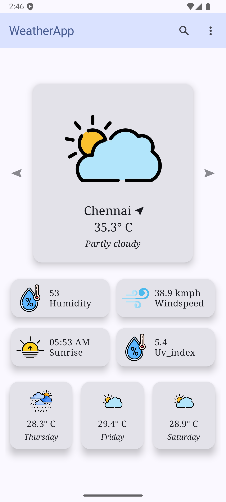

## Developed using Clean + MVI architecture structure
```
com.example.weatherapp
├── presentation
│   ├── models
│   ├── screens
│   ├── viewmodel
├── domain
│   ├── usecase
│   └── repository
├── data
│   ├── model
│   ├── remote
│   └── repository
│── di
└── utils
```

